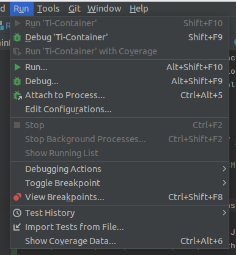
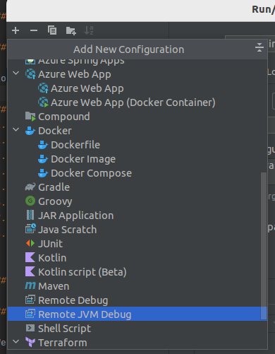
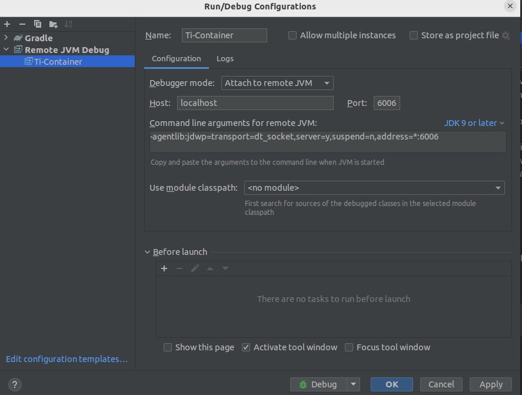
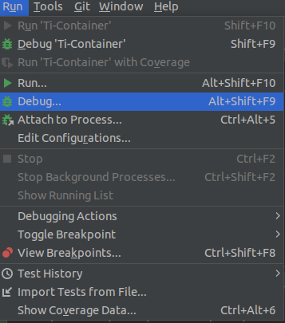
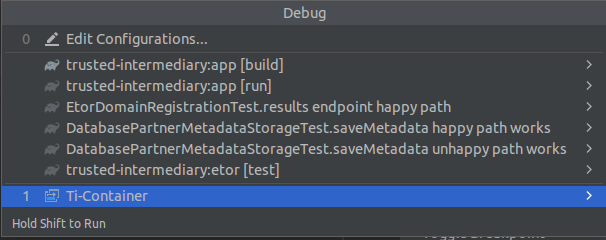
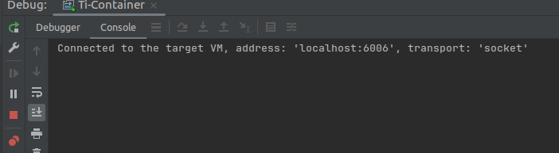

# CDC Trusted Intermediary

## Requirements
Any distribution of the Java 17 JDK.

## Using and Running
To run the application directly, execute...

```shell
./gradlew clean run
```

This will run the web API on port 8080.  You can view the API documentation at `/openapi`.

### Generating and using a token
1. Run `brew install mike-engel/jwt-cli/jwt-cli`
2. Run `jwt encode --exp='+5min' --jti $(uuidgen) --alg RS256  --no-iat -S @/PATH_TO_FILE_ON_YOUR_MACHINE/trusted-intermediary/mock_credentials/organization-trusted-intermediary-private-key-local.pem`
3. Copy token from terminal and paste into your postman body with the key `client_assertion`
4. Add a key to the body with the key `scope` and value of `trusted-intermediary`
5. Body type should be `x-wwww-form-urlencoded`
6. You should be able to run the post call against the `v1/auth/token` endpoint to receive a bearer token [to be used in this step](#submit-request-to-reportstream)


## Development

### Additional Requirements

The additional requirements needed to contribute towards development are...

- [Pre-Commit](https://pre-commit.com)
- [Locust.io](https://docs.locust.io/en/stable/installation.html)
- [Python](https://docs.python-guide.org/starting/installation/)
- [Terraform](https://www.terraform.io)

### Generating .env File

To set up the necessary environment variables, you can use the `generate_env.sh` script. This script will create a `.env` file in the resource folder with the required configuration. Follow these steps:

1. Navigate to the project directory.

2. Run the `generate_env.sh` script:

   ```bash
   ./generate_env.sh
   ```

### Compiling

To compile the application, execute...

```shell
./gradlew shadowJar
```

Once compiled, the built artifact is `/app/build/libs/app-all.jar`.

### Testing

#### Unit Tests

To run the unit tests, execute...

```shell
./gradlew clean allUnitTests
```

#### End-to-end Tests

End-to-end tests are meant to interact and assert the overall flow of the API is operating correctly. They require that the API to be running already.

To run them, execute...

```shell
./gradlew e2e:clean e2e:test
```

The previous command requires the API to be running already. To help streamline the execution of this flow, a helper Bash script can be executed...

```shell
./e2e-execute.sh
```

This will start the API, wait for it to respond, run the end-to-end tests against that running API, and then stop the API.

These tests are located under the `e2e` Gradle sub-project directory.  Like any Gradle project, there are the `main` and `test` directories.
The `test` directory contains the tests.  The `main` directory contains our custom framework that helps us interact with the API.

#### Load Testing

Load tests are completed with [Locust.io](https://docs.locust.io/en/stable/installation.html).  Run the load tests by
running...

```shell
./load-execute.sh
```

This will run the API for you, so no need to run it manually.

The `locustfile.py` that specifies the load test is located at
[`./operations/locustfile.py`](./operations/locustfile.py).

If you want to run the load test in an interactive mode, run...

```shell
locust -f ./operations/locustfile.py
```

The terminal will start a local web interface, and you can enter
the swarm parameters for the test and the local url where the app is running
(usually http://localhost:8080).  You can also set time limits for the tests under 'Advanced Settings'.

### Debugging

#### Docker Container Debugging Using Java Debug Wire Protocal (JDWP)

Go into the `Dockerfile` file and change `CMD ["java", "-jar", "app.jar"]` to `CMD ["java", "-agentlib:jdwp=transport=dt_socket,address=*:6006,server=y,suspend=n", "-jar", "app.jar"]`

#### Steps
1. In Intellij, click on Run and select Edit Configurations 
2. Create a new Remote JVM Debug 
3. Set up the configuration for the remote JVM debug to look like this. 
4. In your code, set your breakpoint, and then start your docker container with `docker-compose up --build`
5. Once your docker container is running, in order to attach, select Run again.
6. Select Debug (not Attach to Process) 
7. Select your Docker Debug that you set up in step 3 
8. A console window will pop up that will show you that it is connected to Docker, and at that point, you can interact with your container and then step through the code at your breakpoints. 


### Deploying

#### Environments

We have a number of environments that are split between CDC and non-CDC Azure Entra domains and subscriptions.

##### Internal

The Internal environment is meant to be the Wild West.  Meaning anyone can push to it to test something, and there is no
requirement that only good builds be pushed to it.  Use the Internal environment if you want to test something in a
deployed environment in a _non-CDC_ Azure Entra domain and subscription.

To deploy to the Internal environment...
1. Check with the team that no one is already using it.
2. [Find the `internal` branch](https://github.com/CDCgov/trusted-intermediary/branches/all?query=internal) and delete
   it inGitHub.
3. Delete your local `internal` branch if needed.
   ```shell
   git branch -D internal
   ```
4. From the branch you want to test, create a new `internal` branch.
   ```shell
   git checkout -b internal
   ```
5. Push the branch to GitHub.
   ```shell
   git push --set-upstream origin internal
   ```

Then the [deploy](https://github.com/CDCgov/trusted-intermediary/actions/workflows/internal-deploy.yml) will run.
Remember that you now have the `internal` branch checked out locally.  If you make subsequent code changes, you will
make them on the `internal` branch instead of your original branch.

##### Dev

The Dev environment is similar to the Internal environment but deploys to a CDC Azure Entra domain and subscription.  It
is also meant to be the Wild West.  Dev deploys similarly to the Internal environment, but you interact with the
`dev` branch.

##### Staging

The Staging environment is production-like and meant to be stable.  It deploys to a non-CDC Azure Entra domain and
subscription.  Deployments occur when a commit is made to the `main` branch.  `main` is a protected branch and requires
PR reviews before merge.

##### Prod

The Prod environment does not exist yet.

#### Initial Azure and GitHub Configuration

There is minimal set-up to do to get Terraform squared away before you can run the Terraform commands in
a new Azure environment in the Flexion Entra domain.  For example, the `internal` environment.  This does not apply to the CDC
Entra domains and subscriptions.

1. Create a resource group.
2. Create a storage account inside the aforementioned resource group.
3. Within the new storage account, create a Container.
4. Within Azure Entra...
   1. Create an App Registration.
   2. Add federated credentials to the App Registration
      - `repo:CDCgov/trusted-intermediary:ref:refs/heads/main` (for terraform apply).
      - `repo:CDCgov/trusted-intermediary:environment:staging` (for staging webapp deploy).
      - And presumably other repo paths needed in the future for other environments and branches.
   3. Within your Subscription, assign the Contributor role to the previously created App Registration.
5. Add GitHub Action secrets to your GitHub repository.
   - A secret with the tenant ID from Azure Entra directory.
   - A secret with the ID from the subscription that everything should be deployed into.
   - A secret with the ID of the App Registration created previously.
6. Create a copy of one of the environments under the [operations](./operations) folder.
   1. Name the copy off of the name of the new environment.
   2. Edit the `main.tf` file with the names of the resources previously created: `resource_group_name`,
      `storage_account_name`, `container_name`.  Also update the `environment` to match the new folder name.
7. Create a GitHub Action workflow so that automatic deploys can occur.  You can take inspiration from our
   [Internal environment deployment](./.github/workflows/internal-deploy.yml).  Make sure you set the `AZURE_CLIENT_ID`,
   `AZURE_TENANT_ID`, and `AZURE_SUBSCRIPTION_ID` based on the secrets created previously.

### Pre-Commit Hooks

We use [`pre-commit`](https://pre-commit.com) to run [some hooks](./.pre-commit-config.yaml) on every commit.  These
hooks do linting to ensure things are in a good spot before a commit is made.  Please install `pre-commit` and then
install the hooks.

```shell
pre-commit install
```

### Contributing

Anyone is encouraged to contribute to the repository by [forking](https://help.github.com/articles/fork-a-repo)
and submitting a pull request. (If you are new to GitHub, you might start with a
[basic tutorial](https://help.github.com/articles/set-up-git).) By contributing
to this project, you grant a world-wide, royalty-free, perpetual, irrevocable,
non-exclusive, transferable license to all users under the terms of the
[Apache Software License v2](http://www.apache.org/licenses/LICENSE-2.0.html) or
later.

Please read [`CONTRIBUTING.md`](CONTRIBUTING.md) for additional details.

All comments, messages, pull requests, and other submissions received through
CDC including this GitHub page may be subject to applicable federal law, including but not limited to the Federal Records Act, and may be archived. Learn more at [http://www.cdc.gov/other/privacy.html](http://www.cdc.gov/other/privacy.html).

### Database

For database documentation [go here](/docs/database.md)

### Setup with ReportStream

#### CDC-TI Setup

1. Checkout `main` branch for `CDCgov/trusted-intermediary`
2. Edit the `app/src/main/java/gov/hhs/cdc/trustedintermediary/etor/EtorDomainRegistration.java` file and replace:
   ```Java
   if (ApplicationContext.getEnvironment().equalsIgnoreCase("local")) {
      ApplicationContext.register(RSEndpointClient.class, MockRSEndpointClient.getInstance());
   } else {
      ApplicationContext.register(RSEndpointClient.class, ReportStreamEndpointClient.getInstance());
      ApplicationContext.register(AzureClient.class, AzureClient.getInstance());
   }
   ```
   with:
   ```Java
   ApplicationContext.register(RSEndpointClient.class, ReportStreamEndpointClient.getInstance());
   ApplicationContext.register(AzureClient.class, AzureClient.getInstance());
   ```
3. Run TI with `./gradlew clean app:run`

#### ReportStream Setup

For Apple Silicon you will want to enable the Docker option for `Use Rosetta for x86/amd64 emulation on Apple Silicon`.
After enabling this option it is recommended that you delete all docker images and containers and rebuild them
with this option enabled.

1. Checkout `master` branch for `CDCgov/prime-reportstream`
2. CD to `prime-reportstream/prime-router`
3. Run the `./cleanslate` script. For more information you can refer to the [ReportStream docs](https://github.com/CDCgov/prime-reportstream/blob/master/prime-router/docs/docs-deprecated/getting-started/getting-started.md#building-the-baseline)
4. Run RS with `docker compose up --build -d`
5. Run `./gradlew resetDB && ./gradlew reloadTable && ./gradlew reloadSettings`
6. Edit `/settings/staging/0166-flexion-staging-results-handling.yml`
   1. Comment the lines related to staging settings, and uncomment the ones for local settings:
      1. `authTokenUrl`, `reportUrl`, `authHeaders.host` under REST `transport` in `receivers`
      2. `type` and `credentialName` under SFTP `transport` in `receivers`
7. Run `./prime multiple-settings set -i ./settings/staging/0166-flexion-staging-results-handling.yml`
8. Run `./prime organization addkey --public-key /path/to/trusted-intermediary/mock_credentials/organization-trusted-intermediary-public-key-local.pem --scope "flexion.*.report" --orgName flexion --kid flexion.etor-service-sender --doit`
9. Setup local vault secret
   1. Go to: `http://localhost:8200/`
   2. Use token in `prime-router/.vault/env/.env.local` to authenticate
   3. Go to `Secrets engines` > `secret/` > `Create secret`
      1. Create secret for `flexion.etor-service-receiver-orders`
         1. Path for this secret: `FLEXION--ETOR-SERVICE-RECEIVER-ORDERS`
         2. JSON data:
         ```
         {
            "@type": "UserApiKey",
            "apiKey": "Contents of file at trusted-intermediary/mock_credentials/organization-report-stream-private-key-local.pem",
            "user": "flexion"
         }
         ```
      2. Create secret for `flexion.etor-service-receiver-results`
         1. Path for this secret: `FLEXION--ETOR-SERVICE-RECEIVER-RESULTS`
         2. JSON data:
         ```
         {
         "@type": "UserApiKey",
         "apiKey": "Contents of file at trusted-intermediary/mock_credentials/organization-report-stream-private-key-local.pem",
         "user": "flexion"
         }

#### Submit request to ReportStream

```
curl --header 'Content-Type: application/hl7-v2' --header 'Client: flexion.simulated-hospital' --header 'Authorization: Bearer <token>' --data-binary '@/path/to/message.hl7' 'http://localhost:7071/api/waters'
```

or

```
curl --header 'Content-Type: application/fhir+ndjson' --header 'Client: flexion.etor-service-sender' --header 'Authorization: Bearer <token>' --data-binary '@/path/to/message.fhir' 'http://localhost:7071/api/waters'
```

After one or two minutes, check that hl7 files have been dropped to `prime-reportstream/prime-router/build/sftp` folder

**Note**: `<token>` should be replaced by the bearer token received from the `/api/token` endpoint

## DORA Metrics

We use [DORA Metrics](https://cloud.google.com/blog/products/devops-sre/using-the-four-keys-to-measure-your-devops-performance) to measure our DevOps performance. We currently are tracking Deployment Frequency, Change Fail Rate and Mean Time to Recovery.

The metrics are produced weekly using a [Github Action](https://github.com/CDCgov/trusted-intermediary/actions/workflows/metrics.yml) and written into CSV files which are available for download in the [workflow job's artifacts]((https://github.com/CDCgov/trusted-intermediary/actions/workflows/metrics.yml)).

## Related Documents

- [Open Practices](open_practices.md)
- [Rules of Behavior](rules_of_behavior.md)
- [Thanks and Acknowledgements](thanks.md)
- [Disclaimer](DISCLAIMER.md)
- [Contribution Notice](CONTRIBUTING.md)
- [Code of Conduct](code-of-conduct.md)

## CDC Notices

### Public Domain Standard Notice

This repository constitutes a work of the United States Government and is not
subject to domestic copyright protection under 17 USC § 105. This repository is in
the public domain within the United States, and copyright and related rights in
the work worldwide are waived through the [CC0 1.0 Universal public domain dedication](https://creativecommons.org/publicdomain/zero/1.0/).
All contributions to this repository will be released under the CC0 dedication. By
submitting a pull request you are agreeing to comply with this waiver of
copyright interest.

### License Standard Notice

The repository utilizes code licensed under the terms of the Apache Software
License and therefore is licensed under ASL v2 or later.

This source code in this repository is free: you can redistribute it and/or modify it under
the terms of the Apache Software License version 2, or (at your option) any
later version.

This source code in this repository is distributed in the hope that it will be useful, but WITHOUT ANY
WARRANTY; without even the implied warranty of MERCHANTABILITY or FITNESS FOR A
PARTICULAR PURPOSE. See the Apache Software License for more details.

You should have received a copy of the Apache Software License along with this
program. If not, see http://www.apache.org/licenses/LICENSE-2.0.html

The source code forked from other open source projects will inherit its license.

### Privacy Standard Notice

This repository contains only non-sensitive, publicly available data and
information. All material and community participation is covered by the
[Disclaimer](DISCLAIMER.md) and [Code of Conduct](code-of-conduct.md).
For more information about CDC's privacy policy, please visit [http://www.cdc.gov/other/privacy.html](https://www.cdc.gov/other/privacy.html).

### Records Management Standard Notice

This repository is not a source of government records, but is a copy to increase
collaboration and collaborative potential. All government records will be
published through the [CDC website](http://www.cdc.gov).

### Additional Standard Notices

Please refer to [CDC's Template Repository](https://github.com/CDCgov/template)
for more information about [contributing to this repository](https://github.com/CDCgov/template/blob/master/CONTRIBUTING.md),
[public domain notices and disclaimers](https://github.com/CDCgov/template/blob/master/DISCLAIMER.md),
and [code of conduct](https://github.com/CDCgov/template/blob/master/code-of-conduct.md).
