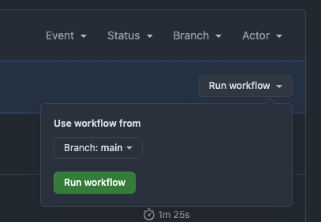

# ReportStream Integration Test

The ReportStream Integration Test is a framework meant to add test coverage for the integration between the
Intermediary and ReportStream. It's scheduled to run daily using the
[automated-staging-test-run.yml](/.github/workflows/automated-staging-test-run.yml) workflow

Information on how to set up the sample files evaluated by the tests can be found [here](/examples/Test/Automated/README.md)

## Important Notes

- The output files generated by the framework are stored in an Azure blob storage container. Every time the tests are run, a cleanup task moves the files to a folder with the year/month/day format for better organization. The files are retained in the container for 90 days before being deleted
- The code that organizes the files is using EST time zone. This means that if you are in PST, you may run into an issue if you submit a run before 9 PM PST and then run the tests after 9pm. You'd need to make sure to run both tasks before or after 9pm so the files are where they are expected to be

## Running the tests

### Automatically

There are two scheduled tasks that run every weekday around midnight EST:

- [Automated Staging Test - Submit Messages](https://github.com/CDCgov/trusted-intermediary/actions/workflows/automated-staging-test-submit.yml) submits the messages in `/examples/Test/Automated`
- [Automated Staging Test - Run integration tests](https://github.com/CDCgov/trusted-intermediary/actions/workflows/automated-staging-test-run.yml) triggers a couple of hours later and runs the Automated Tests on the input files in `/examples/Test/Automated` and the output files in the Azure storage container.

### Manually from your local machine

When running locally, we usually run the tests from either the command line using gradle, or from IntelliJ. Please note that even though you are running the test from your local machine, the test will need to connect to the Azure container to pull the output files to apply the assertions on. For this reason, you will need to set the `AZURE_STORAGE_CONNECTION_STRING` environment variable to authenticate the connection to Azure. You can find the value for `AZURE_STORAGE_CONNECTION_STRING` in Keybase (keybase://team/cdc_ti/service_keys/TI/staging/azure-storage-connection-string-for-automated-rs-e2e-tests.txt).

From the command line:

1. Set the `AZURE_STORAGE_CONNECTION_STRING` environment variable in your shell
2. Run: `./gradlew rs-e2e:clean rs-e2e:automatedTest`

From IntelliJ:

1. Set `AZURE_STORAGE_CONNECTION_STRING` environment variable in the IntelliJ test run configuration (instructions on how to do that [here](https://stackoverflow.com/a/32761503))
2. Go to `rs-e2e/src/test/groovy/gov/hhs/cdc/trustedintermediary/rse2e/AutomatedTest.groovy` and either run or debug `AutomatedTest` as you normally would from IntelliJ

### Manually via Github

1. Run the [Automated Staging Test - Submit Messages](https://github.com/CDCgov/trusted-intermediary/actions/workflows/automated-staging-test-submit.yml) action
2. Wait for RS and TI to finish processing files
3. Run the [Automated Staging Test - Run integration tests](https://github.com/CDCgov/trusted-intermediary/actions/workflows/automated-staging-test-run.yml) action

#### Testing a branch

If you have added new files to `/examples/Test/Automated` in your branch/PR, before running the `Automated Staging Test - Submit Messages` action in step 1, select the branch you're working on as shown in the screenshot below. This will make sure to include your new file(s) when submitting the messages.

If you have added new assertion rules to the [assertion_definitions.json](/rs-e2e/src/main/resources/assertion_definitions.json) file, you should do the same for step 3 and select your branch when running the `Automated Staging Test - Run integration tests` action.

Instead of running the `Run integration tests` action, you could also test it from your local machine by following the steps in the previous section.

## Assertions Definition

The assertions for the integration tests are defined in the
[assertion_definitions.json](/rs-e2e/src/main/resources/assertion_definitions.json) file, which uses
the same rules engine framework as the transformations and validations in the [etor](/etor) project

### File Structure

The file contains a list of definitions which each contain:

- `name`: a descriptive name for the assertions group
- `conditions`: a list of conditions to be met. These determine whether this set of
  assertions apply to the file being evaluated. When no conditions are included, the definition
  applies to all files. If conditions are included, all of them must be satisfied for the
  definition to apply. Conditions are structured the same way as rules
- `rules`: a list of assertions to evaluate

#### Rules

The rules are the assertions for the integration test. The assertions are HL7 expressions inspired
by `FHIRPath`. The current assertions we allow are: equality, non-equality, membership, and
segment count. We can evaluate strings and/or values in HL7 fields. An HL7 field in a rule
can be in either the input file or the output file. If no file is specified, we assume it's the output.
Each rule is contained in double quotes and any string values are contained in single quotes

Examples:

- Equality between an HL7 field in the output and input
  - `"MSH-10 = input.MSH-10"` - `MSH-10` has the same value in the output and input files
  - `"output.MSH-10 = input.MSH-10"` - same as above
- Equality between an HL7 field and a string
  - `"MSH-4 = 'CDPH'"` - the value of `MSH-4` in the output file equals `CDPH`
  - `"MSH-4 != ''"` - the value of `MSH-4` in the output file doesn't equal an empty string
- Membership
  - `"MSH-6 in ('R797', 'R508')"` - the value of `MSH-6` in the output file is either `R797` or `R508`
- Segment count
  - `"OBR.count() = 1"` - there is only one `OBR` segment in the file
